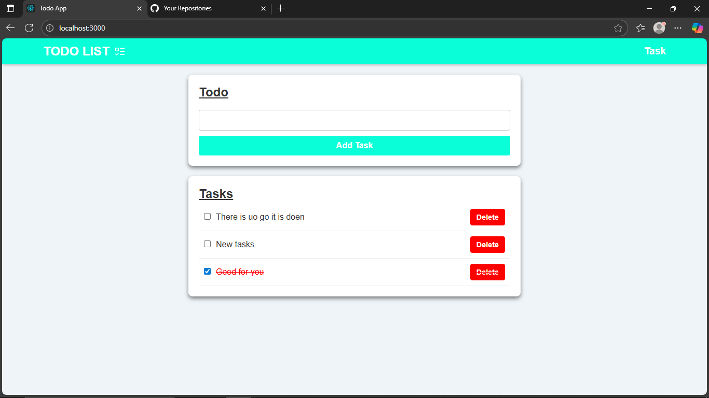

# Todo List React App

A simple and modern Todo List application built with React. This project demonstrates state management, local storage persistence, and component-based architecture. It allows users to add, complete, and delete tasks, with all data stored locally in the browser.
---

## Screenshot



## Features

- **Add Tasks:** Users can add new tasks to their todo list.
- **Complete Tasks:** Mark tasks as completed using a checkbox.
- **Delete Tasks:** Remove tasks from the list.
- **Persistent Storage:** Tasks are saved in the browser's localStorage, so they remain after page reloads.
- **Component Structure:** Clean separation of concerns using React components (Home, Task, TaskPage, Navbar).
- **Navigation:** Simple navigation using React Router (if enabled).
- **Responsive UI:** Basic styling for usability and clarity.

## Folder Structure

```
frontend/
├── public/
│   ├── favicon.ico
│   └── index.html
├── src/
│   ├── App.js
│   ├── App.css
│   ├── index.js
│   ├── index.css
│   ├── logo.svg
│   ├── reportWebVitals.js
│   ├── setupTests.js
│   ├── pages/
│   │   ├── Home.jsx
│   │   ├── Navbar.jsx
│   │   ├── Task.jsx
│   │   └── TaskPage.jsx
│   └── styles/
│       ├── Home.css
│       └── Navbar.css
├── package.json
└── README.md
```

## Main Components

- **Home.jsx:** Main page for adding tasks and viewing the todo list. Handles state and localStorage logic.
- **Task.jsx:** Renders individual tasks with complete and delete functionality.
- **TaskPage.jsx:** (Optional) Separate page to view and manage tasks.
- **Navbar.jsx:** Navigation bar for the app.

## How It Works

- Tasks are managed in React state and synchronized with localStorage.
- Adding a task updates the state and saves to localStorage.
- Completing or deleting a task updates the state and localStorage.
- The UI updates automatically based on the current state.

## Getting Started

### Prerequisites
- Node.js and npm installed

### Installation
1. Clone the repository:
   ```sh
   git clone <your-repo-url>
   cd Todo-list/frontend
   ```
2. Install dependencies:
   ```sh
   npm install
   ```
3. Start the development server:
   ```sh
   npm start
   ```
4. Open [http://localhost:3000](http://localhost:3000) in your browser.

## Customization
- You can modify styles in the `src/styles/` folder.
- Add more features (e.g., task descriptions, due dates) by extending the state and UI.

## Technologies Used
- React
- JavaScript (ES6+)
- CSS
- LocalStorage API

## License
This project is open source and available under the MIT License.

## Author
- Chirag 

---
Feel free to contribute or suggest improvements!
